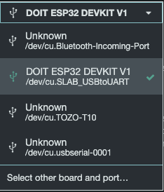
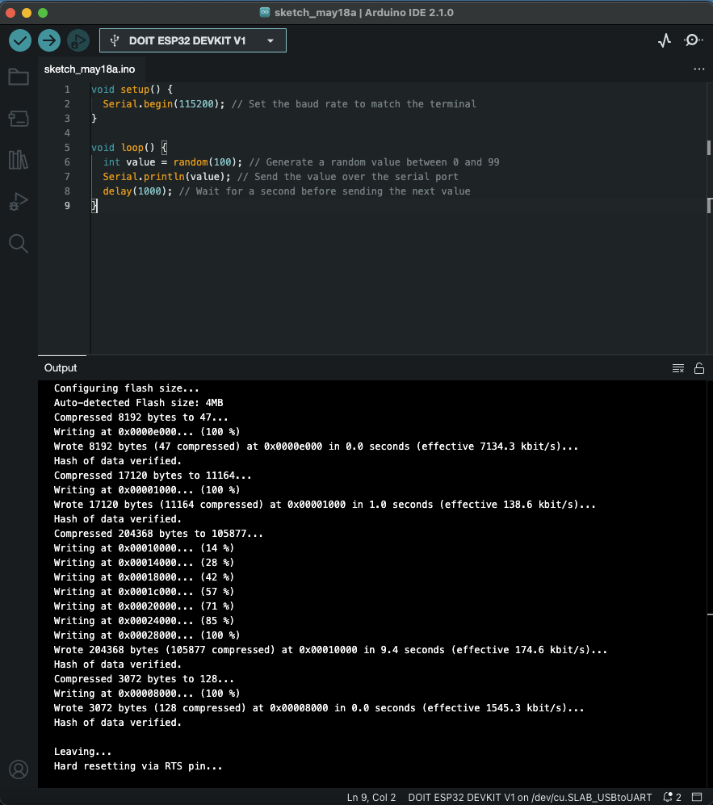
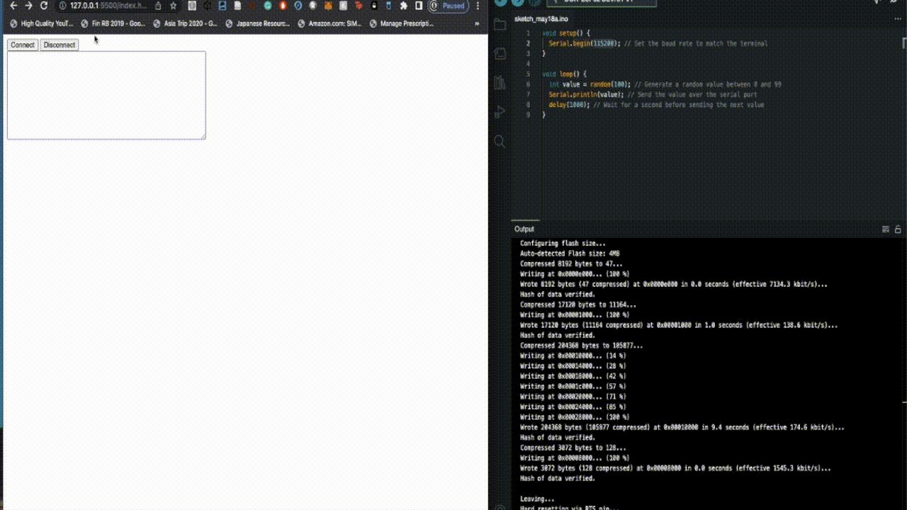

# Introduction

The current version (1.1) takes serial data from an ESP32 and outputs data to a simple chart on a responsive website. This code should work on any code that uses Arduino. I am using a 2015 Macbook Pro on MacOS Monterey to run the following.

## Disclaimer

This code is using an API only available on Chrome.
**Please use chrome to run this.**

## Changelog

- Version 1.0
  - Tested old version of Serial library w/ node JS options. Library is broken.
  - Used Chrome's Web Serial API to build a browser-based serial output website.
- Version 1.1
  - Using Bootstrap to make the web application responsive.
  - Using Chart.js and some JS hackery to allow reading of the Serial data + live plotting.

## Steps to Run

- First, ensure that your Arduino code matches that in `Random_Serial_Data.ino`.
  - If you are using an ESP32 on a Mac, the following apply to you:
    - Check that your Board Config looks like this:
      - 
    - Check that your Arduino File looks like this: 
  - Run the code on your ESP32 or other Arduino-compatible hardware.
- I use visual studio code, so I prefer using something called `Live Server` to test my dynamic/static sites. I'd suggest using this in this case to test your code.
  - Installation information can be found [here.](https://marketplace.visualstudio.com/items?itemName=ritwickdey.LiveServer)
  - After installation, go to the `index.html` file and click `Go Live` at the bottom of VS.
    - It should open the webpage!
  - If you're not using Live Server, find another way to host the index.html file!
- Then, go to `localhost:5500` if you use live server.
  - Click the `Connect` button and select the port to your hardware device.
  - If all goes well, the information should show on the web site!

## Demo Videos

### Version 1.1

### Version 1.0

